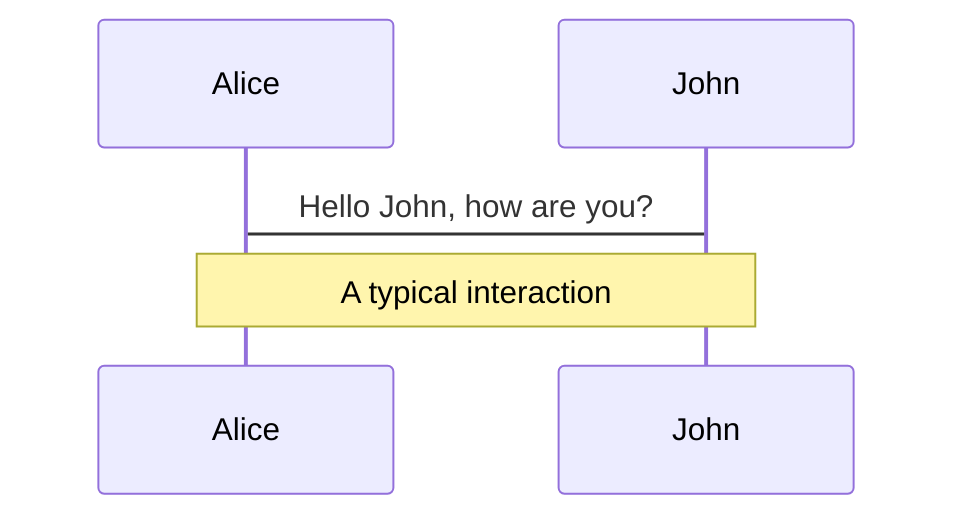
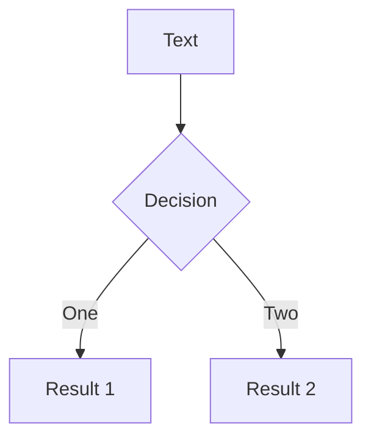
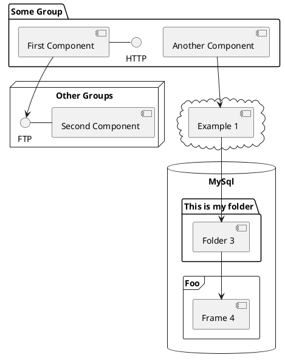

---
# try also 'default' to start simple
theme: seriph
# random image from a curated Unsplash collection by Anthony
# like them? see https://unsplash.com/collections/94734566/slidev
background: https://source.unsplash.com/collection/94734566/1920x1080
# apply any windi css classes to the current slide
class: 'text-center'
# https://sli.dev/custom/highlighters.html
highlighter: shiki
# show line numbers in code blocks
lineNumbers: false
# some information about the slides, markdown enabled
info: |
  ## Slidev Starter Template
  Presentation slides for developers.

  Learn more at [Sli.dev](https://sli.dev)
# persist drawings in exports and build
drawings:
  persist: false
# use UnoCSS (experimental)
css: unocss
---

# 鸟瞰前端

Presentation slides for developers

<div class="pt-12">
  <span @click="$slidev.nav.next" class="px-2 py-1 rounded cursor-pointer" hover="bg-white bg-opacity-10">
    Press Space for next page <carbon:arrow-right class="inline"/>
  </span>
</div>

<div class="abs-br m-6 flex gap-2">
  <button @click="$slidev.nav.openInEditor()" title="Open in Editor" class="text-xl icon-btn opacity-50 !border-none !hover:text-white">
    <carbon:edit />
  </button>
  <a href="https://github.com/slidevjs/slidev" target="_blank" alt="GitHub"
    class="text-xl icon-btn opacity-50 !border-none !hover:text-white">
    <carbon-logo-github />
  </a>
</div>

<!--
The last comment block of each slide will be treated as slide notes. It will be visible and editable in Presenter Mode along with the slide. [Read more in the docs](https://sli.dev/guide/syntax.html#notes)
-->

---
layout: image-right
image: https://images.unsplash.com/photo-1591267990439-bc68529677c3?ixlib=rb-1.2.1&ixid=MnwxMjA3fDB8MHxwaG90by1wYWdlfHx8fGVufDB8fHx8&auto=format&fit=crop&w=1706&q=80/1920x1080
---

# 目录

1. 前端定义

2. 做什么

3. 怎么做

4. 软技能

5. 技术栈

6. 学习资料

7. 未来

---

# 前端定义

<br>

- 软件程序或网站的前端是一切与用户交互的媒介

- 创建流畅或无阻塞的用户体验的应用

- 应用程序或页面布局

<!-- 软件程序或网站的前端是一切与用户交互的媒介。 从用户的角度来看，前端与用户界面是同义词。 从开发人员的角度来看，前端是界面设计、代码驱动界面功能。 相反，后端包括发生在幕后的功能和数据处理。

前端开发的主要目标之一是创建流畅或无阻塞的用户体验的应用。 换句话说，应用程序或网站的前端应该直观且易用。 虽然这听起来像是一个简单的目标，但它可能会非常复杂，因为并非所有用户或设备都是相同的。 例如，为移动设备开发的应用程序需要与桌面应用程序截然不同的前端。 网站必须在多种设备和屏幕尺寸上运行良好，这也是现代 Web 开发通常涉及响应式设计的原因。


前端所涉及的主要内容：

应用程序或页面布局
图形
音视频元素
文字内容
用户界面元素（按钮、链接、工具栏、导航栏等）
输入区域（对话框）、表单域、文本区域等）
用户流（一个界面如何通向下一个界面）
用户偏好、主题和自定义


用户输入内容通过前端接收并在程序或网站的后端进行处理。 后端代码读取和写入数据并通过前端将输出发送给用户。 由于应用程序或网站的后端和前端协同工作，因此软件工作通常需要前端和后端开发。  -->

---

# 做什么

- 使用 HTML, CSS, JavaScript 将设计变为现实，开发和维护用户界面

- 持续优化用户体验，统一的交互体验

- 网站响应式设计，考虑不同尺寸窗口页面展示效果，用户操作反馈等

- 管理自己软件开发工作流程

- 遵循最佳实践，如代码语义化，SEO，A11y等

- 修复错误并测试可用性，保证交付质量

<!--
设计变为现实：如Web网页，APP等交互界面

管理自己软件开发工作流程：软件开发过程中，经常会有中断，会议等穿插进来，会干扰开发节奏，我们应该培养自己的开发节奏，尽可能减少中断带来的影响。

遵循最佳实践：一般是一些经验提炼，规范定义。比如语义化，可以提高网站SEO的打分，代码可读性高。A11y是无障碍访问的简写，为有访问网站障碍的用户考虑，利于屏幕阅读器理解区分。

交付质量：是开发者的名片，交付前应该仔细自测，如果测试同事写了测试用例，最好能够自己跑一遍测试用例，保证模块高质量交付。

 -->
---

# 

一些实现

> todo

VSCode, Facebook Messager, Twitch, Microsoft Teams etc

---

# 怎么做

- HTML(超文本标记语言): 开发网站所需的基本构建块，一种允许您在不同于常规文本的数字文档中做笔记的语言

- CSS(层叠样式表): 用于创建您使用 HTML 创建的页面的布局、颜色、样式等的语言

- JavaScript: 确定页面将做什么的开发人员的编程语言

- Framework: 用于一致、高效和准确地开发软件的平台

- UI(用户界面): 应用程序的图形布局

- UX(用户体验): 用户如何与应用程序交互

- 版本控制: 跟踪和控制源代码更改的过程

--- 

# 软技能

仅凭技术能力不足以胜任前端角色。 任何软件开发工作都必须具备数学、分析、创造力、设计和解决问题的能力。 在数字优先或纯数字环境中，软技能更为重要。

- 时间管理

- 沟通

- 项目管理

- 创造力

- 解决问题的能力

<!-- 
时间管理：需要做任务拆分，任务估时，任务完成时间等，还需要处理中断事件带来的时间消耗，如穿插着做核酸，开会，节日活动等事件。

沟通：与同事沟通应注意双方理解、认知的不同，领域的不同，尽量调整语言来达成共识，如跟项目经理的沟通、UI、后端、测试同事的沟通，都应该尽量减少自己专业词汇的出现

创造力：条条大路通罗马。一个需求的实现，可能会有多种方法，应该在平衡时间和进度之前找的平衡点，努力探寻最适合的方式来实现

解决问题的能力：多培养学习的方法，学习如何学习，如何解决问题。应该减少互相之前的依赖。随着网页、浏览器的发展，项目需求复杂度也会越来越高，新技术不断涌现，可能很多问题别人也没遇到过。一些建议：1. 阅读英文文档；2. 擅用搜索引擎，如Bing，Google，DuckDuckGo等；3. 学习到的知识，分享给他人，教会别人

 -->

---

# 技术栈

- Language: [<logos-ecma />ES6 +](https://www.ecma-international.org/publications-and-standards/standards/ecma-262/), [<VscodeIconsFileTypeTypescriptOfficial />TypeScript](https://www.typescriptlang.org/)

- Framework: [<VscodeIconsFileTypeVue />Vuejs 2](https://v2.vuejs.org/), [<LogosNuxtIcon />Nuxt 3](https://v3.nuxtjs.org/)

- Build: [<LogosWebpack />Webpack 4](https://v4.webpack.js.org/concepts/), [<LogosVitejs />Vite 2](https://vitejs.dev/), [<LogosRollupjs />Rollup](https://rollupjs.org/), [<LogosEsbuild />esbuild](https://esbuild.github.io/) 

- UI: [<LogosElement />ElementUI](https://element.eleme.cn/#/zh-CN/component/installation), [<PrimePrime class="text-blue-500 text-xl" />PrimeVue](https://www.primefaces.org/primevue/)

- CSS: [<FileIconsWindi class="text-blue-400" />WindiCSS](https://windicss.org/), [<LogosUnocss />UnoCSS](https://uno.antfu.me/), [<LogosTailwindcssIcon />TailwindCSS 2](https://v2.tailwindcss.com/)

- Charts: [<SimpleIconsApacheecharts class="text-red-600" />ECharts](https://echarts.apache.org/), [<LogosHighcharts />Highcharts](https://www.highcharts.com/)

- Utils: [<LogosLodash />Lodash](https://lodash.com/), [Date-fns](https://date-fns.org/), [AntV X6](https://antv-x6.gitee.io/zh), [<IconParkOutlineEarth class="text-green-600" />ArcGIS](https://developers.arcgis.com/)

---

# 学习资料

- [MDN](https://developer.mozilla.org/en-US/docs/Learn/Front-end_web_developer)<uim-rocket class="text-xl text-green-500 mx-2" />

- [JavaScript.INFO](https://javascript.info/)

- [Javascript Tutorial](https://www.javascripttutorial.net/)

- [FreeCodeCamp](https://www.freecodecamp.org/)

- [W3schools](https://www.w3schools.com/)

- [Vue2 Style Guide](https://v2.vuejs.org/v2/style-guide/)

- [以太坊](https://ethereum.org/)

---

# 未来

AI based web

- WebGL: GIS, BIM etc

- DAPPS

- voice commands

- smart recommendation algorithms

- automated coding

- AR/VR

---

# What is Slidev?

Slidev is a slides maker and presenter designed for developers, consist of the following features

- 📝 **Text-based** - focus on the content with Markdown, and then style them later
- 🎨 **Themable** - theme can be shared and used with npm packages
- 🧑‍💻 **Developer Friendly** - code highlighting, live coding with autocompletion
- 🤹 **Interactive** - embedding Vue components to enhance your expressions
- 🎥 **Recording** - built-in recording and camera view
- 📤 **Portable** - export into PDF, PNGs, or even a hostable SPA
- 🛠 **Hackable** - anything possible on a webpage

<br>
<br>

Read more about [Why Slidev?](https://sli.dev/guide/why)

<!--
You can have `style` tag in markdown to override the style for the current page.
Learn more: https://sli.dev/guide/syntax#embedded-styles
-->

<style>
h1 {
  background-color: #2B90B6;
  background-image: linear-gradient(45deg, #4EC5D4 10%, #146b8c 20%);
  background-size: 100%;
  -webkit-background-clip: text;
  -moz-background-clip: text;
  -webkit-text-fill-color: transparent;
  -moz-text-fill-color: transparent;
}
</style>

---

# Navigation

Hover on the bottom-left corner to see the navigation's controls panel, [learn more](https://sli.dev/guide/navigation.html)

### Keyboard Shortcuts

|     |     |
| --- | --- |
| <kbd>right</kbd> / <kbd>space</kbd>| next animation or slide |
| <kbd>left</kbd>  / <kbd>shift</kbd><kbd>space</kbd> | previous animation or slide |
| <kbd>up</kbd> | previous slide |
| <kbd>down</kbd> | next slide |

<!-- https://sli.dev/guide/animations.html#click-animations -->

<p v-after class="absolute bottom-23 left-45 opacity-30 transform -rotate-10">Here!</p>

---
layout: image-right
image: https://source.unsplash.com/collection/94734566/1920x1080
---

# Code

Use code snippets and get the highlighting directly![^1]

```ts {all|2|1-6|9|all}
interface User {
  id: number
  firstName: string
  lastName: string
  role: string
}

function updateUser(id: number, update: User) {
  const user = getUser(id)
  const newUser = { ...user, ...update }
  saveUser(id, newUser)
}
```

<arrow v-click="3" x1="400" y1="420" x2="230" y2="330" color="#564" width="3" arrowSize="1" />

[^1]: [Learn More](https://sli.dev/guide/syntax.html#line-highlighting)

<style>
.footnotes-sep {
  @apply mt-20 opacity-10;
}
.footnotes {
  @apply text-sm opacity-75;
}
.footnote-backref {
  display: none;
}
</style>

---

# Components

<div grid="~ cols-2 gap-4">
<div>

You can use Vue components directly inside your slides.

We have provided a few built-in components like `<Tweet/>` and `<Youtube/>` that you can use directly. And adding your custom components is also super easy.

```html
<Counter :count="10" />
```

<!-- ./components/Counter.vue -->
<Counter :count="10" m="t-4" />

Check out [the guides](https://sli.dev/builtin/components.html) for more.

</div>
<div>

```html
<Tweet id="1390115482657726468" />
```

<Tweet id="1390115482657726468" scale="0.65" />

</div>
</div>


---
class: px-20
---

# Themes

Slidev comes with powerful theming support. Themes can provide styles, layouts, components, or even configurations for tools. Switching between themes by just **one edit** in your frontmatter:

<div grid="~ cols-2 gap-2" m="-t-2">

```yaml
---
theme: default
---
```

```yaml
---
theme: seriph
---
```


</div>

Read more about [How to use a theme](https://sli.dev/themes/use.html) and
check out the [Awesome Themes Gallery](https://sli.dev/themes/gallery.html).

---
preload: false
---

# Animations

Animations are powered by [@vueuse/motion](https://motion.vueuse.org/).

```html
<div
  v-motion
  :initial="{ x: -80 }"
  :enter="{ x: 0 }">
  Slidev
</div>
```

<div class="w-60 relative mt-6">
  <div class="relative w-40 h-40">
    
    
    
  </div>

  <div
    class="text-5xl absolute top-14 left-40 text-[#2B90B6] -z-1"
    v-motion
    :initial="{ x: -80, opacity: 0}"
    :enter="{ x: 0, opacity: 1, transition: { delay: 2000, duration: 1000 } }">
    Slidev
  </div>
</div>

<!-- vue script setup scripts can be directly used in markdown, and will only affects current page -->
<script setup lang="ts">
const final = {
  x: 0,
  y: 0,
  rotate: 0,
  scale: 1,
  transition: {
    type: 'spring',
    damping: 10,
    stiffness: 20,
    mass: 2
  }
}
</script>

<div
  v-motion
  :initial="{ x:35, y: 40, opacity: 0}"
  :enter="{ y: 0, opacity: 1, transition: { delay: 3500 } }">

[Learn More](https://sli.dev/guide/animations.html#motion)

</div>

---

# LaTeX

LaTeX is supported out-of-box powered by [KaTeX](https://katex.org/).

<br>

Inline $\sqrt{3x-1}+(1+x)^2$

Block
$$
\begin{array}{c}

\nabla \times \vec{\mathbf{B}} -\, \frac1c\, \frac{\partial\vec{\mathbf{E}}}{\partial t} &
= \frac{4\pi}{c}\vec{\mathbf{j}}    \nabla \cdot \vec{\mathbf{E}} & = 4 \pi \rho \\

\nabla \times \vec{\mathbf{E}}\, +\, \frac1c\, \frac{\partial\vec{\mathbf{B}}}{\partial t} & = \vec{\mathbf{0}} \\

\nabla \cdot \vec{\mathbf{B}} & = 0

\end{array}
$$

<br>

[Learn more](https://sli.dev/guide/syntax#latex)

---

# Diagrams

You can create diagrams / graphs from textual descriptions, directly in your Markdown.

<div class="grid grid-cols-3 gap-10 pt-4 -mb-6">







</div>

[Learn More](https://sli.dev/guide/syntax.html#diagrams)


---
layout: center
class: text-center
---

# Learn More

[Documentations](https://sli.dev) · [GitHub](https://github.com/slidevjs/slidev) · [Showcases](https://sli.dev/showcases.html)
